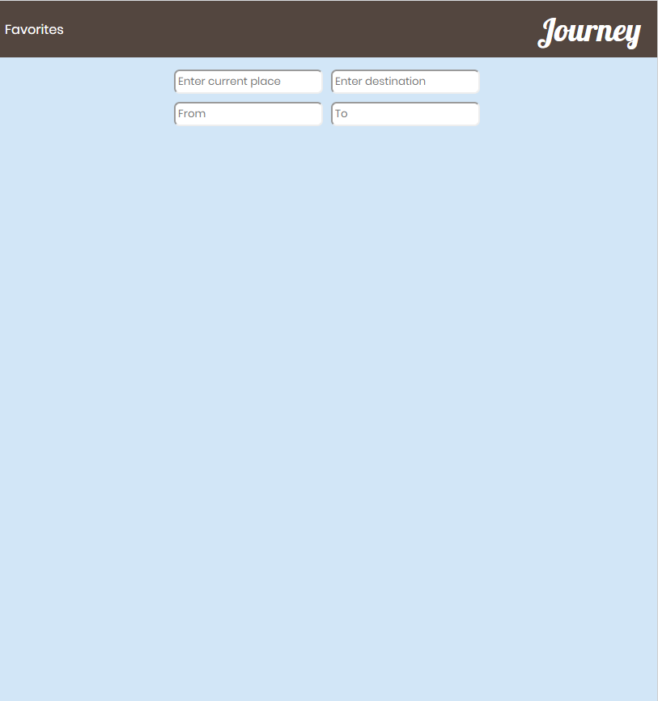

# Journey-App

Journey-App is a places weather and flights  search app platform built with Jquery includes weather in cities, places to travel , and flights to the city.

## Contributors
- Noam Mualmi (nonomu)
- Renee Cohen (Renee88)
- Yonatan Ahi(yonatanahi)

## Table Of Contents
- [Journey App](#Journey-App)
  - [Contributors](#contributors)
  - [Table Of Contents](#table-of-contents)
  - [Running the project](#running-the-project)
  - [Screenshots](#screenshots)
    - [Home](#home)
    - [Place&Date](#Place&Date)
    - [PlaceFilter](#PlaceFilter)
    - [Places](#Places)
    - [Flights](#Flights)
    - [Favorites](#favorites)
  - [Tech-stack](#tech-stack)

## Running the project
1. Clone the repo.
2. Run `npm install`.
3. Run `node server.js`.
4. Run `mongod`
5. Navigate to `http://localhost:4200`

## Screenshots

### Home
A home page of App . The user can choose find place or see his favorites.

### Place&Date
Choose form. User can input place and date.

### PlaceFilter

### Places
User see places by his choise and also can choose flights or add to favorites.

### Flights
Get flights to destination from current input location user will redirect to wiki website to close flight.

### Favorites
View user favorites by city and delete option.

## Tech-stack
1. Jquery, Handelbars, CSS3 , Ajax.
2. Express (Node.js), Mongoose (MongoDB).
3. Google city AutoComplete Api.
4. Weather Api.
5. Kiwi Flights Api
